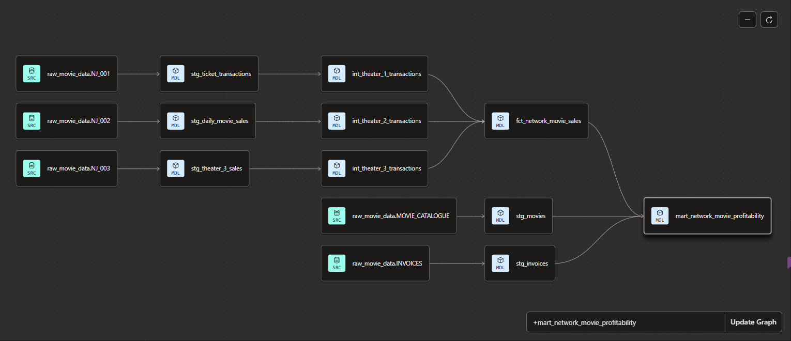

# The Silver Screen Project: Corporate Theater Network Profitability Engine

## Project Overview
The Silver Screen Project was designed to solve a critical commercial blind spot for a multi-location movie theater network (`NJ_001`, `NJ_002`, and `NJ_003`). Previously, individual branches operated on isolated, mismatched point-of-sale (POS) systems, preventing corporate leadership from understanding aggregate box office performance or accurately assessing film profitability against external studio costs.

This project engineers a robust, production-grade cloud data pipeline that consolidates fragmented transaction logs, normalizes data streams, integrates studio invoice structures, and exposes a final, high-integrity data mart tailored for executive decision-making.

---

## Data Architecture & Lineage

The data architecture follows a modern ELT (Extract, Load, Transform) paradigm utilizing a multi-layered design pattern within the cloud data warehouse to separate computational concerns and maximize performance.

1. **Sources:** Raw ingest of disparate theater logs (`NJ_001`, `NJ_002`, `NJ_003`), the master `MOVIE_CATALOGUE`, and global studio `INVOICES`.
2. **Staging Layer (`stg_`):** Atomic cleanup models where data type casting (`CAST()`), date normalization, and structural formatting occur.
3. **Intermediate Layer (`int_`):** Heavy operational rollup and aggregation layer transforming daily transaction grains into unified monthly metrics.
4. **Fact Layer (`fct_`):** A consolidated, network-wide performance table combining all individual theater logs via set operators.
5. **Mart Layer (`mart_`):** The final, customer-facing business intelligence layer joining theater revenue with context-rich studio cost matrices.

---

## Tools & Technology Stack
* **Data Warehouse:** Snowflake (Cloud Compute & Storage Isolation)
* **Data Transformation & Modeling:** dbt Cloud (Data Build Tool)
* **Version Control:** Git & GitHub
* **Orchestration:** dbt Cloud Scheduler
* **Target BI Layer:** Tableau

---

## The Engineering Process
* **Schema Alignment:** Resolved critical structural conflicts across point-of-sale endpoints (e.g., mapping and aliasing localized structural variations into a standardized `location` grain).
* **Data Aggregation:** Constructed robust `GROUP BY` logic utilizing aggregators like `SUM()` to process localized transactions into predictable reporting periods.
* **Granular Joins:** Executed multi-conditional `LEFT JOIN` operations across revenue and cost structures, linking datasets precisely on composite dimensions (`movie_id` and `reporting_month`).
* **Safe Math Implementations:** Handled real-world operational anomalies by wrapping calculations in `NULLIF()` constraints to eliminate "divide-by-zero" runtime errors during margin processing.

---

## Key Insights & Business Discovery
Building an analytical layer directly over the production data mart exposed vital structural vulnerabilities in the theater network's business model:

1. **Systemic Negative Margins:** Deep-dive analysis revealed that every physical theater location is operating at a net loss. This diagnosed a network-wide structural flaw rather than localized operational mismanagement.
2. **The Flat-Fee Trap (Hidden Margin Killers):** High-grossing blockbusters were identified as core cash drains. While driving high ticket volumes, the aggressive flat-fee invoices demanded by major distribution studios completely eclipsed box office revenues.
3. **Genre Sweet Spots:** Mid-budget, targeted genres (e.g., Horror and Comedy) carry significantly lower upfront studio rental fees, yielding far superior percentage cost-efficiency margins relative to capital risk.

---

## Strategic Recommendations & Next Steps
* **Contract Restructuring:** Shift immediately from rigid, high-risk flat-fee studio rental invoices to dynamic, performance-based revenue-split models.
* **Dynamic Programming:** Optimize screen allocation across all theater locations by scaling down low-margin blockbusters after opening weekend and filling screens with high-margin, consistent genre favorites.
* **Tableau Integration:** Connect the live `mart_network_movie_profitability` view directly to an executive Tableau dashboard to provide stakeholders with daily, interactive visibility into fluid margin movements.

---

## Governance, Quality Control, and Automation
* **Data Quality Control:** Implemented automated dbt data testing constraints (`unique`, `not_null`) across critical primary keys such as `movie_id` and transaction records to guarantee absolute financial reconciliation.
* **Automation & Orchestration:** Built, tested, and verified a centralized dbt Cloud Connection Profile and Deployment Job. The entire pipeline compiles using a single automated `dbt build` command, completely isolating unstable development sandboxes from pristine production reporting environments.

---

## About Me
I am a full stack analytical problem-solver transitioning a deep, 25-year foundation in philosophy, systematic reasoning, and structured logic into the field of **Data Analysis, Data Engineering and Business Intelligence**. I specialize in turning complex, messy data ecosystems into highly structured, automated, and insights-driven pipelines that solve real-world corporate challenges.

📧 [Insert your Email] | 🔗 [[Insert your LinkedIn Profile Link](https://www.linkedin.com/in/ubiratan-gonzaga/)]
